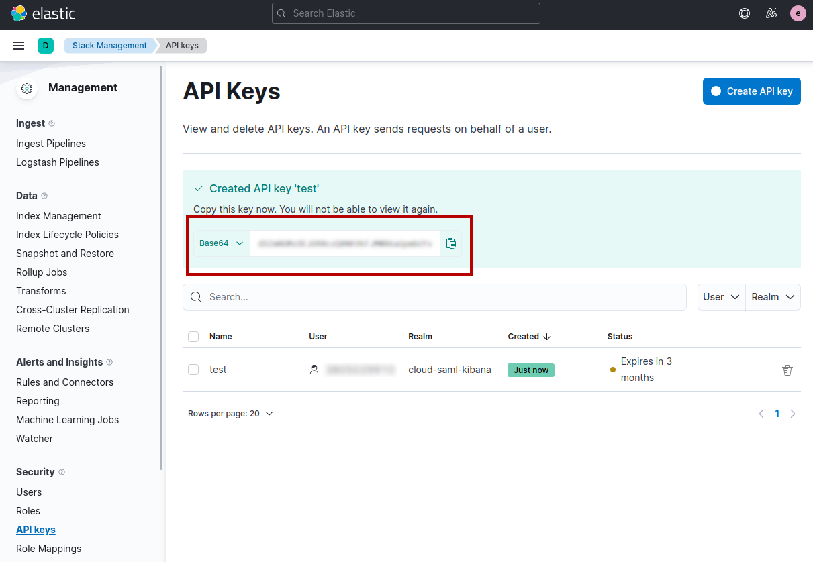

## Elasticsearch Arduino Client

This is an experimental library to connect [Arduino](https://www.arduino.cc/) boards to [Elasticsearch](https://github.com/elastic/elasticsearch) and [Elastic Cloud](https://www.elastic.co/cloud/).

### Configuration using Elastic Cloud

[Elastic Cloud](https://www.elastic.co/cloud/) is the cloud solution offered by Elastic.

You can connect your Arduino to Elastic Cloud in order to send data (e.g. coming from sensors)
or to read aggregated data from the cloud (e.g. the average between two dates).

This bridge between Arduino and Elasticsearch gives you the possibility to use all the features of Elasticsearch to analyze and consume data coming from your Arduino installations.
Moreover, using [Kibana](https://www.elastic.co/kibana/), included in Elastic Cloud, you can build advanced dashboard to monitor your data in real-time.

To connect your Arduino to Elastic Cloud you need the following information:
- the Elasticsearch server address (i.e. public URL);
- the Elastic Cloud API key;

You can retrieve these information from your Elastic Cloud dashboard. You need to open the 
**Manage Deployments** page and **Copy endpoint** of Elasticsearch (see screenshot below).


This endpoint is the server address of Arduino (e.g. https://my-deploy.es.us-central1.gcp.cloud.es.io).

After this step, you need to generate an `API key` in the `Management` page under the section 
`Security`.


When you click on `Create API key` button you can choose a name and set the 
other options (for example, restrict privileges, expire after time, and so on).


After this step you will get the `API key`in the API keys page. 



**IMPORTANT**: you need to copy and store the `API key`in a secure place, since 
you will not be able to view it again in Elastic Cloud.

When you have the Elasticsearch address and the `API Key` you can store these
information in the `elasticsearch_config.h` (see the [examples](examples)).

```
#define ELASTIC_ENDPOINT ""
#define ELASTIC_CLOUD_API_KEY ""
```

### Configuration using Elasticsearch on-premise

You can use the Elasticsearch Arduino client also to connect to a local Elasticsearch
managed by you.

You can use two different approaches using Basic Authentication or OAuth2 token.

#### Basic authentication

Usually with basic authentication you have a `username` and a `password` to be used to
connect to Elasticsearch. These informations are reported when you execute Elasticsearch
server. With these information you can use the `ESClient::setBasicAuth(username, password)`
to configure the connection.

We suggest to store the `username` and `password` in the `elasticsearch_config.h`:

```
#define ELASTIC_USERNAME ""
#define ELASTIC_PASSWORD ""
```

#### OAuth2 token

ELasticsearch supports the OAuth2 Bearer authentication. You need to have a valid token to
be able to connect to Elasticsearch. This token can be generated using the procedure
reported in the [official documentation](https://www.elastic.co/guide/en/elasticsearch/reference/current/security-api-get-token.html).

When you have a valid token, you can use the `ESClient::setOAuth2Token(token)` to configure
the connection.

We suggest to store the OAuth2 token in the `elasticsearch_config.h`:

```
#define ELASTIC_OAUTH2_TOKEN ""
```

### Arduino models tested

The library has been tested with the following Arduino models:

- [MKR WiFi 1010](https://docs.arduino.cc/hardware/mkr-wifi-1010)
- [NANO RP2040 Connect](https://docs.arduino.cc/hardware/nano-rp2040-connect)

We are testing the [Portenta H7](https://www.arduino.cc/pro/hardware-product-portenta-h7) but this
will require the usage of an alternative TLS library since `WiFiNINA` [does not work](https://forum.arduino.cc/t/wifinina-and-portenta/666979) with Portenta models.

### Examples

We reported some examples of sketch where we take a temperature from an external/internal
sensor and we index this temperature in Elasticsearch using Elatic Cloud.

We have also a specific example to retrieve the average temperature of the last 1 hour
performing an aggregation search to Elasticsearch.

The examples are based on the following `temperature` time series mapping in Elaticsearch:

```
PUT /temperature
{
  "mappings": {
    "properties": {
      "@timestamp": { 
        "type": "date",
        "format": "date_optional_time||epoch_second"
      },
      "temp": {
        "type": "half_float"
      }
    }
  }
}
```

A `@timestamp` and a `temp` float number, that's it.


### License

[MIT](LICENSE) © [Enrico Zimuel](https://www.zimuel.it/)
